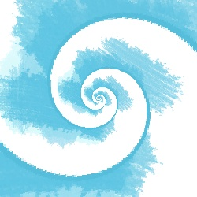

Logarithmic Image Transformation
---
## これは何？  
画像を螺旋状に変換する[エッシャーくん](http://mglab.blogspot.com/2008/09/blog-post_20.html)のソースコードへのリンクが切れていたので元の文献を参考に実装した。

## 動作確認  
* Windows 10  
* python(3.8.5)  

## 使い方  
```cmd
pip install -r requirements.txt
python main.py ^
    imgs\source3.jpg ^
    imgs\source3.dst.jpg ^
    config.json ^
    --inverse_mapping ^
    --bg_color 255 255 255 ^
    --pre_resize_scale 0.25
```

## 処理結果
|  処理前  |  処理例1  | 処理例2 |
| ---- | ---- | ---- |
|  ぐるぐるしていない  |  ぐるぐるしている  |  もっとぐるぐるしている  |
|    |  |　 |

## メモ  
[参考文献](http://www.josleys.com/article_show.php?id=82)の式展開を追ったときのメモ。  

### Stage 1
$\log(z)$で変換する
（自然対数で処理する。）

$z \mapsto \log(z)$は複素平面を虚数軸に0から$2\pi$まで、実数軸に$-\infty$から$+\infty$のストライプ状の平面へ変換する。
複素平面上のあらゆる点は$re^{i\theta}$として表現できる。
$\log(z)=\log(r)+i\theta$

しかし、任意の整数nに対して、$re^{i\theta}=re^{i(\theta+n2\pi)}$なので、$n2\pi$と$(n+1)2\pi$の並行したストライプは、一つの複素平面に対応する。言い換えると変換$\log(z)$は１つの複素平面を無数のコピーに変換する。

画像変換に於いて$\log(z)$がどのように利用されるか半径$r_1$と$r_2$の同心円を利用して確認しましょう。（$r_1 \lt r_2$）

$z \mapsto \log(z/r_1)$で変換すると、外側の円は実数軸=$\log(r_2/r_1)$の縦線に変換され、内側の円は実数軸=0の縦線へ変換されます。

### Stage 2: 回転とスケーリング
図3の対角線が虚数軸と一致するように回転させます。

そして、対角線の長さが$2\pi$に一致するように縮めます。

変換の意味で、これは$z \mapsto zf\exp(i\alpha)$に一致します。

ここで$\alpha=\arctan(\log(r_2/r_1)/2\pi)$、で$f=\cos(\alpha)$です（図４）。

次のステージでは、フェーズ１の対数変換の逆変換を行います。


### Stage 3: べき乗
次に、図4の矩形を$z\mapsto \exp(z)$の変換で変換します。これにより図5の状況になります。

図4の矩形のすべての辺は、螺旋状に変換されます。ここで、ポイントAとA’はそれぞれ$2i$と$0$から各々1へ変換されるため、一致します。

図5：べき乗変換

これで基本的な変換の説明は終わりです。

これらのステージをすべて組み合わせることで、変換は$z \mapsto (z/r_1)^\beta$となります。ここで、$\beta=f\exp(i\alpha)$

もともとの2重円の画像は、変換$z\mapsto z/(r_2/r_1)$により、一致する画像へ変換されます。

そのため、変換済みの画像に於いて、もし、$z$が$(r_1/r_2)^\beta$で割られることで、一致するコピーが得られます。

ここでステージ2に戻ります。図4の矩形が平面を敷き詰めるように置換し、ステージ3の処理を再び行います。

図6の矩形Eは図5中の元の矩形で、ステージ3の変換により図7のエリアEに変換されます。
図6の矩形GとHも同様に図7のエリアEに変換されます。
図6の矩形Fは図7のエリアFへ変換されます。
このようにして、継ぎ目のない螺旋状に埋め尽くすように変換できる元の画像の複製を無限に得ることができる。
図７の領域Ｅを拡大・回転させることで、領域Ｆを正確に覆うことができる。

ステージ2の設定、つまり、回転拡縮し対角線の長さ$2\pi$になるような変換以外にも可能な設定がある。可能なすべての設定を図8に示します。回転が0°か180°で、スケール係数が1であるなら、変換は同心円状のコピーを無限に生成する。それ以外のケースであれば、スケール係数は$f=\cos\alpha$で、回転は$\alpha, \pi-\alpha, \pi+\alpha, -\alpha$のいずれかです。

まとめると、変換のロジックは以下のとおりです。

* $r_1$と$r_2$を選ぶ、円の中心が原点からずれるように調整する必要があります。
* $\alpha, f, \beta$を計算します。
* 円の間のエリアのために、$\beta \log(z/r_1)$を計算し、得られる矩形を埋め尽くし、最後に、すべての画素について$\exp\beta\log(z/r_1)$を計算します。 

この変換はUltrafractalに実装されてます。

このアルゴリズムは、同心の円以外、あるいは円でなく多角形にも適用できます。
図15aの2つの矩形の間のエリアは図15bの網掛けのエリアに変換されます。
このエリアは2つの矩形の間の角度のオフセットに基づき埋め尽くされます。
べき変換後、図15cが得られます。
対数変換ごと埋め尽くされた平面を回転させることで、図15dを得られます。

望むなら変換後の画像を無限にズームイン・アウトすることができます。$\beta$の値は小さい画像と大きい画像の間の比から求まるため、初期画像と一致させるための倍率と回転も求まります。有限な枚数のフレームを用意することで、無限のズーム映像を用意することができます。図16に例を示します。


図17に小さい正方形が大きい正方形の中心とずれている配置の例を示します。
この場合は、変換の基準点を求める必要があります。
$C_L$を大きい正方形の中心、$C_S$を小さい正方形の中心、$\theta$を2つの矩形の間の角度のズレ、$m$を大きい正方形に対する小さい正方形のサイズの比とすると、基準点$C_F$は$C_F=C_L+(C_L-C_S)/(1-m\exp(i\theta))$で求まる。
対数変換は$z\mapsto \log ((z-C_F)/a)$ここで、$a$は$C_F$から小さい正方形の辺までの最短距離。
全体の変換は、$z\mapsto ((z-C_F)/a)^\beta$ここで、$\beta=f\exp(i\alpha)$で、$f=2\pi/(2\pi-\theta)\cos\alpha$で、$\alpha=\arctan(\log(m)/2\pi)$です。
一致するコピーは$m^(f\exp(i(\alpha-\phi))/\cos\phi)$、ここで$\phi=\arctan\theta/\log(m)$の絶対値と偏角による拡大と回転により実現する。

最後に、変換は任意の形に適用できます。 この場合、問題の形状を完全に透明にする必要がある。
次に、画像ファイルのアルファチャンネルを読み取ることで、アルゴリズムに形状の縁を見つけさせることができます。透過ピクセルのアルファチャンネルの値はゼロなので、単純なアルゴリズムでリムの位置を見つけることができます。図２４は、これを説明するための一連の画像を示している。右側の画像の壁の上の領域をまず透明にして、中央の画像を得ます。次に、透明領域内の点を選択し、大きさを決定します。これにより、透明領域の外側に同様の領域（透明画像に対して回転させてもよい）ができます。

### 備考：
* すべてのステージを組み合わせると$z \mapsto (z/r_1)^\beta$になる。
    
    1. $z\mapsto \log(z/r_1)$
    1. $z\mapsto z\beta,~ where~ \beta=f\exp(i\alpha)$ 
    1. $z\mapsto \exp(z)$
    
    を組み合わせる。

    上の2つを合わせると、
    
    $z\mapsto\beta \log(z/r_1)=\log(z/r_1)^\beta$
    
    これに最後の一つを合わせると

    $z\mapsto \exp(\log(z/r_1)^\beta)=(z/r_1)^\beta$

* 回転とスケーリングが$z\mapsto f\exp(i\alpha)$に一致する。

    まず回転$\alpha$について、
    矩形を$\alpha$だけ回転させると、対角線が虚数軸に一致するような$\alpha$は、図中の矩形の短辺長辺の長さから
    $\tan(\alpha)=\log(r_2/r_1)/2\pi$なので、$\alpha=\arctan(\log(r_2/r_1)/2\pi)$と求まる。

    次に、スケール$f$について、
    矩形を$f$倍すると、対角線の長さが回転後の長辺の長さ($2\pi$)に一致するような$f$は、
    対角線の長さを仮に$d$と置くと、$d\times f=2\pi$と表わせ、$f=2\pi/d=\cos(\alpha)$と求まる。

    つまり、所望の回転とスケーリングは、もとの矩形を$\alpha$だけ回転させ、$f$だけ拡大すれば達成できることがわかる。
    
    ここで、複素平面での回転とスケールは、複素数の掛け算で処理できることを利用する。
    所望の操作は、$f(\cos\alpha+i\sin\alpha)$で表される複素数をかけることで行える。
    また、 複素数$z=x+iy$の指数関数$\exp(z)$は$\exp(z)=\exp(x+iy)=\exp(x)(\cos y+i\sin y)$と定義されるため、所望の操作は$f(\cos\alpha+i\sin\alpha)=f\exp(0)(\cos\alpha+i\sin\alpha)=f\exp(0+i\alpha)=f\exp(i\alpha)$をかけることに一致することがわかる。


## 参考
- [Artful Mathematics: The Heritage of M. C. Escher](http://www.ams.org/notices/200304/fea-escher.pdf)  
- [A logarithmic image transformation](http://www.josleys.com/article_show.php?id=82)  
- [エッシャーっぽい絵を生成する「エッシャーくん」を作ってみた。](http://mglab.blogspot.com/2008/09/blog-post_20.html)
- [複素数の指数関数・対数関数・べき関数](http://www.eng.niigata-u.ac.jp/~nomoto/2.html)
- [複素数７｜複素平面上の拡大縮小/回転は複素数をかけろ！](https://yama-taku.science/mathematics/complex-number/rotation-of-points-and-vectors/)
